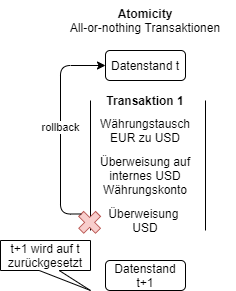
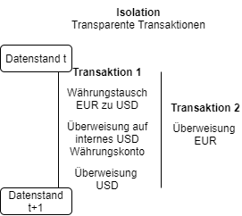

# ACID
ACID ist ein Konzept, das mit relationalen Datenbanken assoziert wird, aber nicht ausschließlich auf diese begrenzt ist. Grundsätzlich kann jede Art von Datenbank ACID-konform implementiert werden, insbesondere im standalone Betrieb.

Das ACID Modell steht für 4 Eigenschaften von DBMS, die Datenkonsistenz gewährleisten (Meier & Kaufmann (2019), S. 124):

## Atomicity
**Atomicity**: Alle Operationen/Transaktionen finden als kleinste Einheit komplett oder gar nicht statt (werden zurückgerollt).

Tritt ein Fehler innerhalb der Transaktion auf, werden die zuvor erfolgreich durchgeführten Operationen zurückgerollt, um einen konsisten Datenstand herzustellen. 

Auf das Beispiel bezogen: 
- Soll eine Überweisung in USD von einem europäischen Konto stattfinden, ist erst ein Währungstausch nötig.
- Der umgetauschte EUR Betrag wird dann als USD Betrag auf ein internes Währungskonto überwiesen, d.h. das Ausgangskonto wird mit EUR belastet und dem Währungskonto werden USD gutgeshrieben.
- Dann kann die eigentliche Überweisung vom Währungskonto auf das Zielkonto stattfinden.
- Schlägt diese Überweisung fehl, soll auch der Währungstausch rückgängig gemacht werden und der EUR Betrag dem Ursprungskonto gutgeschrieben werden.

## Consistency
**Consistency**: Nach jeder abgeschlossenen Transaktion ist die Datenbank in einem konsistenten Zustand.

- Die Datenbank ist niemals in einem inkonsistenzen Zustand, d.h. jede Transaktion, die zu inkonsistenten Zuständen führen würde, wird abgelehnt.
- Beispielsweise würden INSERT Operationen abgelehnt, die versuchen unpassende Datentypen zu schreiben.
- Innerhalb einer noch nicht abgeschlossenen Transaktion können inkonsistente Zustände auftreten, solange der Zustand bei Abschluss konsistent ist.

## Isolation
**Isolation**: Kein anderer Prozess/Transaktion kann den Stand der Daten einer nocht nicht abgeschlossenen Transaktion sehen.

Transaktionen finden auf einem definierten und konsisten Datenstand statt. Sie sehen niemals Zwischenstände anderer Transaktionen.

Auf das Beispiel bezogen:
- Angenommen, Transaktion 1 findet zuerst auf Basis von Datenstand t statt.
- Transaktion 1 führt dazu, dass das Konto nach Ausführung der Transaktion einen Stand von 0 EUR aufweist.
- Transaktion 2 beinhaltet eine Überweisung in EUR.
- Falls Transaktion 2 zeitgleich mit Transaktion 1 auf Datenstand t stattfinden würde, wäre diese Überweisung (fälschlicherweise) möglich. Dies würde aber dazu führen, dass danach ein inkonsistenter Datenstand vorliegt (negativer Kontostand).
- Deshalb werden Transaktionen **serialisiert**, d.h. in eine Reihenfolge gebracht, die konsistente Zustände garantieren. Es kann vorkommen, dass Transaktionen dann abgelehnt werden.
- *Bemerkung*: Der Term "Serialisieren" ist hier nicht mit dem Schreiben von Objekten als binäre Datenströme bekannt aus Programmiersprachen zu verwechseln.

## Durability
- **Durability**: Nach einer Schreiboperationen sind die Daten garantiert dauerhaft in der Datenbank gespeichert (persistiert).

Dies gilt auch für den Fall von Backup & Recovery:
- Im Falle von Software Fehlern, Systemabstürzen oder fehlerhaften Speichermedien, bleibt die Durability ebenfalls gewährt.
- Dies wird über Transaktionslogs erreicht, die für ein Backup wieder in der gleichen Reihenfolge ausgeführt werden und die Datenbank in den letzten bekannten Zustand überführen.

# BASE
Einzelne Knoten in einem Cluster sind normalerweise verfügbar (**basically available**), aber sind gegenenfalls nicht mit den neuesten Daten (**eventually consistent**) aktualisiert, sie sind dadurch vorübergehend in einem **'soft state'**. (Vgl. Meier & Kaufmann (2019), S. 140)

Das BASE Paradigma wird typischerweise in Anwendungsszenarien eingesetzt, die eine hohe Verfügbarkeit voraussetzen, wie z.B. Online-Shops, Kartendienste und Suchmaschinen. 
- Basically Available: Das Cluster ist verfügbar, auch wenn Knoten vereinzelt ausfallen sollten. 
- Soft State: Statt sofortiger garantierter Konsistenz werden die Daten auf mehrere Knoten repliziert. Datenkonsistenz ist daher nicht sofort garantiert, es gibt einen fließenden Übergang (soft) in einen konsistenten Zustand, sobald die Replikation abgeschlossen ist.
- Eventually Consistent: Ein Konsistenter Zustand wird irgendwann, aber mit Sicherheit, erreicht, bis dahin sind Operationen ggf. noch auf Basis veralteter Daten möglich.

# ACID versus BASE
Beide Konzepte unterscheiden sich in unterschiedlichen Gesichtspunkten. Eine Auswahl ist in folgender Tabelle dargestellt (Meier & Kaufmann (2019), S. 139 f):

| Aspekt   |      ACID      | BASE |
|----------|:-------------:|:------:|
| **Konsistenz** |    Konsistenz ist oberste Priorität (strong consistency)   | Konsistenz wird nur mittelbar/schließlich (eventually) zugesichert (schwache Konsistenz)  |
| **Nebenläufigkeit** |  Hauptsächlich pessimistische Nebenläufigkeitskontrolle, Methoden mit Locking-Protokollen | Hauptsächlich optimistische Nebenläufigkeitskontrolle mit feingranularen Konfigurationsoptionen|
| **Verfügbarkeit** |  Verfügbarkeit wird für moderate Datenvolumen gewährt | Hochverfügbarkeit und Partitionstoleranz für hochverteilte Data Stores |
| **Integrität** |  Einige Integritäts-Constraints (z.B. referentielle Integrität) werden durch das Schema gewährleistet | Einige Integritäts-Constraints (z.B. referentielle Integrität) werden durch das Schema gewährleistet -> sofern spezifisches Produkt dies unterstützt |

Ein wesentliches Unterscheidungsmerkmal ist der Kompromiss zwischen Konsistenz und Verfügbarkeit: Um Skalierung zu ermöglichen, sind Kompromisse einzugehen (CAP Theorem). Sobald mehr als ein Rechenknoten beteiligt ist, stellt sich die Frage nach der Synchronisierung der Daten zwischen den beteiligten Knoten. Um möglichst wenig Geschwindigkeitseinbußen hinnehmen zu müssen, und den Nutzer nicht in einem synchronen Prozess warten zu lassen, wird oft das Eventual-Consistency Modell verwendet (BASE). 

Produkte befinden sich oft auf einem Spektrum zwischen diesen beiden Zielen und nutzen weitere Konzepte, um Konsistenz bzw. Verfügbarkeit zu gewähren.