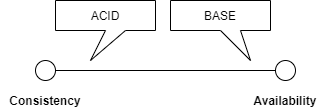

# CAP Theorem
Das CAP Theorem behandelt Anforderungen an verteilte Datenbanken. Derartige Eigenschaften sind für Anwendungsszenarien relevant, die ein hohes Maß an Skalierung erfordern. Die Evaluation von DBMS unter Aspekten des CAP Theorems ist daher stets in einen Kontext einzuordnen. Oft sind solche Betrachtungen für kleinere Szenarien mit weniger ausgeprägten Skalierungsanforderungen nicht sinnvoll.   

## Herausforderungen verteilter Systeme

- Die datenhaltenden Partitionen sind bei verteilten Datenbanken ebenfalls in einem Netzwerk verteilt. Unter "Network Partition Tolerance" wird verstanden, dass 
Lese- und Schreiboperationen ohne Konflikte möglich sind.
- "Consistency" beschreibt, dass jeder Nutzer, die gleichen Daten sieht ("Data Consistency").
- "Availability" umfasst, dass bei einem Ausfall einzelner Knoten, trotzdem das Gesamtsystem, aber auch der aktuelle Datenstand weiter verfügbar sind und Antworten in akzeptabler Zeit liefern.

## CAP Theorem
Das CAP Theorem besagt: Eine Schnittmenge aller 3 Aspekte existiert nicht. Es ist stets ein Kompromiss aus 2 Aspekten zu wählen. Dabei platzieren die Produkte sich auf einen Kontinuum, zwischen beiden Aspekten. Häufig kann die Gewichtung auf den einen oder anderen Aspekt durch Konfiguration des DBMS beeinflusst werden.

- Systeme, die Konsistenz fokussieren, verwenden typischerweise das ACID Paradigma.
- Systeme, die Verfügbarkeit fokussieren, verwenden typischerweise das BASE Paradigma.

## CP - Consistency and Partition Tolerance

Datenbanken in der CP-Kategorie bieten Konsistenz und Fehlertoleranz gegenüber Knotenausfällen im Cluster. Falls ein Netzwerkfehler auftritt und dadurch ein Knoten ausfällt, wird dieser vom Cluster getrennt und ersetzt, bis er wiederhergestellt und wieder funktionfähig ist.

Dieser Wiederherstellungsprozess kann dazu führen, dass das gesamte Cluster nicht verfügbar ist (bis die Mindestzahl an funktionsfähigen Knoten wieder erreicht ist). Dadurch wird gewährleistet, dass die Daten konsistent sind und Nutzer keine veralteten Daten sehen. 

### CP Kernkonzepte
- Pessimistic Locking: 
- Make minority partitions unavailable

### CP Produkte
| Datenmodell   |      Produkt      |
|----------|:-------------:|
| Spalten-orientierte DB |    BigTable, HBase   |
| Dokument-orientierte DB |  MongoDB |
| Key/Value Stores |  MemcacheD, Redis |

## AP - Availability and Partition Tolerance

Datenbanken in der AP-Kategorie erzielen Verfügbarkeit und Netzwerk-Fehlertoleranz auf Kosten von Daten-Konsistenz. Falls ein Partitionsfehler auftritt, bleiben die bestehenden Knoten weiter erreichbar, auch wenn sie eventuell veraltete Daten ausliefern. Typischerweise werden diese Daten aktualisiert, sobald die fehlerhafte Partition repariert werden konnte.

### AP Kernkonzepte
AP:
- NSPF (No Single Point of Failure)
- Conflict Resolution
- Optimistic

### AP Produkte
| Datenmodell   |      Produkt      |
|----------|:-------------:|
| Spalten-orientierte DB |    Cassandra   |
| Dokument-orientierte DB |  CouchDB |
| Key/Value Stores |  Dynamo |

## CA - Consistency and Availability
Datenbanken in der CA-Kategorie bieten eine Clusterlösung, die Konsistenz und Verfügbarkeit über alle Knoten gewährleistet. Dies funktioniert nur, wenn die Daten nicht im Netzwerk über Partitionen verteilt sind. Daher kann keine Netzwerk-Fehlertoleranz gewährleistet werden. Jeder Knoten ist in der Lage, die anderen vollständig zu ersetzen. Dies führt aber dazu, dass ein entscheidender Vorteil von Cluster-Lösungen verloren geht: Performance-Gewinn durch Aufteilung einer komplexen Aufgabe auf mehrere Knoten. Lässt man eine solche Verteilung nicht zu, kann man auch nicht die zugehörigen Vorteile erzielen. 

Es finden sich daher nur wenige noSQL Vertreter in dieser Kategorie. Existierende RDBMS bieten mittlerweile leistungsfähige Cluster-Lösungen an, deren Fokus auf Leistungssteigerung im Mehrbenutzerbetrieb liegt. 

### CA Produkte
| Datenmodell   |      Produkt      |
|----------|:-------------:|
| Relationale DB |    Oracle, MySQL, Postgres (jeweils Cluster Modus), ...   |
| Dokument-orientierte DB |  Vertica |
| GraphDB |  Neo4J (Cluster Modus) |