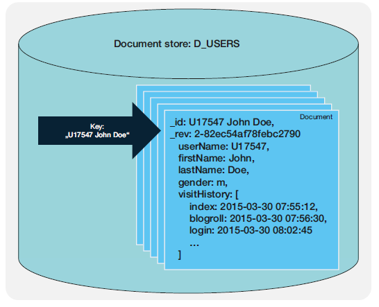

# Dokumenten-orientiertes DBMS
Dokument-orientierte DBMS verwenden **Dokumente** statt Tabellen als zentrale Struktur. Das Format der Dokumente ist typischerweise standardisiert, beispielsweise **JSON oder XML**. Nach Dokumenten kann über einen eindeutigen Schlüssel oder mithilfe spezifischer Attributen gesucht werden. Gegenüber Key/Value Stores weisen Dokumente eine Struktur auf, die auf Applikationsebene in einem Schema interpretiert wird. Aus Sicht des DBMS sind diese Dokumente semi-strukturiert. (Meier & Kaufmann (2019), S. 18.)

Dokument-orientierte DBMS haben große Ähnlichkeit zu Key/Value Stores. Der Wert entspricht einem Datenobjekt in Form eines Dokuments, der Schlüssel wird zur Identifkation dieses Objekts verwendet (Meier & Kaufmann (2019), S. 209).

Die Dokumente enthalten **Datenstrukturen in Form von rekursiv verschachtelten Attribut-Wert Paaren** ohne referentielle Integrität. Diese Strukturen sind Schema-frei, d.h. ein Dokument kann ohne vorher erfolgte Angabe eines Schemas in dem Speicher abgelegt werden.

Viele Dokument-orientierte DBMS nutzen folgende Grundbegriffe:
- **Database**: Namespace mit eindeutigem Namen, sehr ähnlich zu einem Schema in der relationalen Welt.
- **Collection**: Sammlung gleichartiger Dokumente, entspricht in etwa einer Tabelle für eine Entität einschließlich deren Beziehungen.
- **Document**: Kleinste zusammenhängende Einheit bestehend aus rekursiv verschachtelten Feldern, die eindeutig über einen Schlüssel identifiziert werden kann.
- **Field**: Ein Key/Value Paar, wie in JSON-Dokumenten.
- **Data Type**: Ein einfacher oder komplexer Typ, der implizit über die Ausrpägung ermittelt wird.

Lese- und Schreiboperationen beziehen sich auch bei partiellen Updates stets auf ganze Dokumente. Mit nur einer Operation können so komplexe Strukturen geschrieben und gelesen werden. Dokumente sind flexibel und können oft innerhalb der gleichen Collection unterschiedliche (nicht Schlüssel) Felder besitzen.

*Exkurs*:
- **Shard**: Collections können über Shards auf mehrere Server-Knoten verteilt werden (horizontale Skalierung). Über einen Shard-Key wird der Ziel-Shard bestimmt, dazu existieren gesondere Strategien für Performance-Optimierung.
- **Replication**: Faktor der Datenreplikation (wie in Hadoop) für Shards zur Steigerung der Performance und Fault-Tolerance. Writes werden stets über den für den Shard zugewiesenen Master-Knoten abgehandelt.

## Anwendungsgebiete
### Web Anwendungen
JSON-basierte Dokument DBMS sind sehr intuitiv für Web-Entwickler, da sie häufig bereits mit JSON-Objekten in Kombination mit JavaScript/TypeScript arbeiten. Die Idee, diese Objekte auf einfache Weise (serverseitig) zu persistieren, führt zu Dokument-orientierten DBMS oder alternativ einer einfacheren Realisierung in Form von Objekt-Speichern oder Key/Value Stores. 

Die abgefragten JSON-Dokumente können oft ohne oder mit nur wenig Transformationslogik direkt im Browser dargestellt werden. Ein Mapping in andere Objektstrukturen entfällt, da JavaScript/TypeScript nativ mit dem JSON Format umgehen können.

> **_Aufgabe:_** Recherchieren Sie weitere Anwendungsfälle, insbesondere im Bereich Big Data Analyse auf flexiblen Datenstrukturen.

## Produktübersicht
JSON-Dokument basierte DBMS.

| DBMS   |      URL      |  Beschreibung |
|----------|:-------------:|------:|
| Apache CouchDB |  https://couchdb.apache.org/ | - |
| MongoDB |    https://www.mongodb.com/de-de   |   - |

Darüber hinaus existieren XML-basierte Datenbanken, wie z.B. MarkLogic, BaseX, Oracle XML DB.

### MongoDB
MongoDB ist eines der aktuell beliebtesten Dokument-orientierten DBMS aus dem Open Source Bereich. Es ist linear (horizontal & vertikal) skalierbar und erlaubt den standalone oder Cluster-Betrieb. Dokumente folgen dem JSON Format, intern werden sie in einem optimierten Binärformat (BSON) abgespeichert. MongoDB positioniert sich als CP (Consistency + Network Partition Tolerance) mit einem flexiblen Konisistenzmodell.
- C: Atomare Schreibvorgänge sind nur auf Dokument-Ebene möglich, nicht Dokument-übergreifend. 
- P: Unterstützt Master/Slave Replikation mit Sharding als Partitions-Strategie.

MongoDB ist zudem flexibel bezüglich der Synchronosierung von Operationen:
- Consistent Read/Write: Folgt dem ACID Modell und stellt sicher, dass die Daten auf allen Knoten nach einer Schreiboperation synchronisiert sind bzw. dass wirklich die neuesten Daten gelesen werden.
- Eventual consistent Read/Write: Folgt dem BASE Modell und stellt wesentlich performantere Operationen bereit.

Eine Spezialität von MongoDB ist die Unterstützung von Geo-Daten, insb. Koordinaten und Polygonen. Dazu sind spezielle Abfrage-Funktionen vorhanden, um mit diesen Datenstrukturen zu arbeiten.

## Übungsablauf - Übersicht
Die Übung umfasst die folgenden Punkte:

| Uebung   |      Inhalt   |
|----------|:-------------:|
| [Mongo DB - Setup](MongoDB/1_MongoDB_Setup.md) | Aufsetzen der MongoDB Umgebung in Docker, Initialisierung der Beispieldaten |
| [Mongo DB - Data Model](MongoDB/2_DocumentDB_Data_Models.md) | Diskussion des Datenmodells. |
| Key/Value Stores |   | Key/Value Stores für die effiziente Verwaltung untypisierter Name/Wert Paare |
| (Wide) Column Stores |   |  |
| Graph Database |   |  |