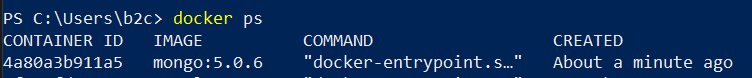
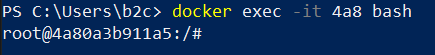
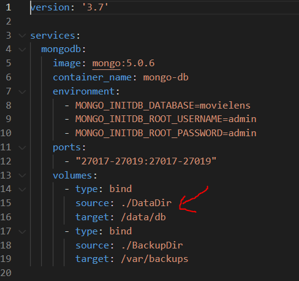
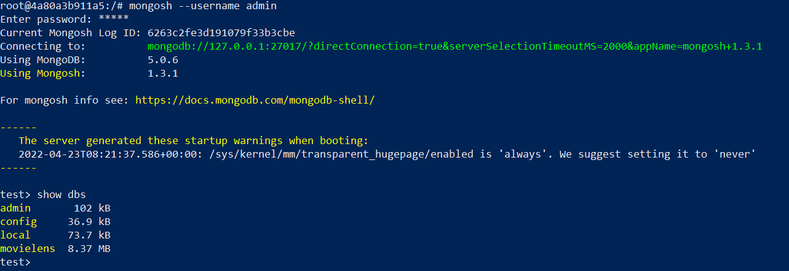
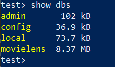
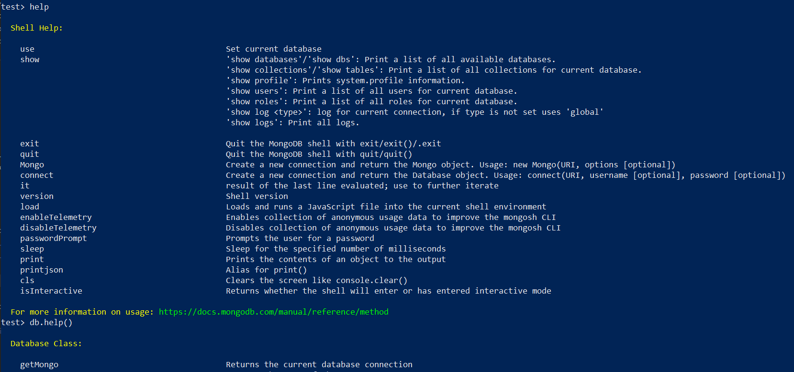
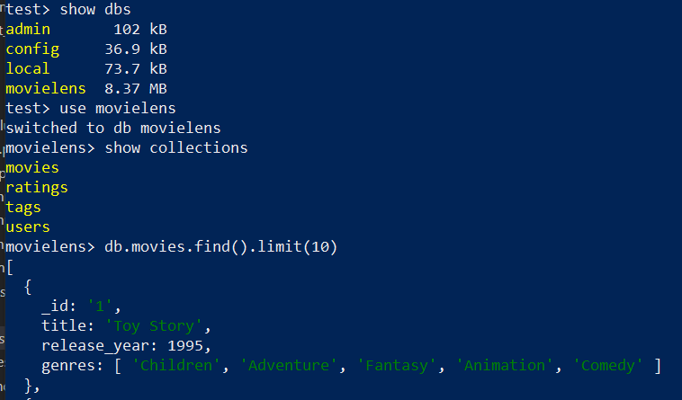
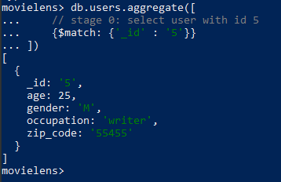
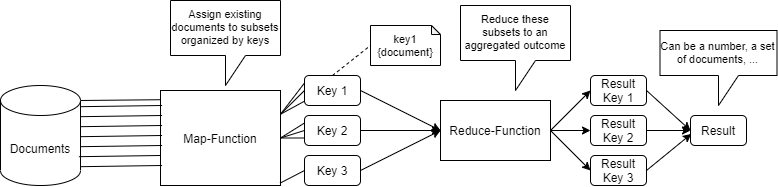

# MongoDB Setup
Zum Aufsetzen der Übungsumgebung wird Docker verwendet. Verwenden Sie eine Shell ihrer Wahl (bei Windows wird Powershell empfohlen), um mit der Docker CLI zu interagieren.


## (1) Start des Containers
Zum Starten des Containers wird Docker Compose genutzt. Dies vereinfacht die Konfiguration deutlich, da die Verknüpfungen in der docker-compose.yml spezifiziert sind.

> **_Aufgabe:_** Richten Sie den MongoDB Container mithilfe der bereitgestellten docker-compose.yaml ein. Nutzen Sie dazu die Hilfestellung in diesem Dokument.

Navigieren Sie per Shell in das MongoDB DockerHome Verzeichnis. In diesem Verzeichnis finden sie die Datei docker-compose.yml. Starten Sie den Container mit:
```
docker-compose up
```
Der Container sollte dann korrekt starten und unter den laufenden Containern gelistet werden. Ihre aktuell geöffnete Shell dient dazu, die Consolen-Outputs der laufenden Container zu verfolgen.

> **_Aufgabe:_** Öffnen Sie eine zweite Shell und prüfen Sie, ob der Container korrekt aufgeführt ist:
```
docker ps
```

Überprüfen Sie, ob die Ausgabe den Mongo Container enthält:



## (2) Verbindung zum MongoDB Server via CLI
Die einfachste Möglichkeit mit MongoDB zu interagieren ist das direkte Arbeiten im Container mit der Mongo Shell, die bereits im Container installiert ist. Innerhalb des Docker Containers befindet man sich in einer simulierten Unix Umgebung, nicht mehr in einer Windows Umgebung. Sie können dort mit allen typischen Unix Befehlen arbeiten (cat, sed, ...).

> **_Aufgabe:_** Öffnen Sie eine interaktive Verbindung (-it) in den MongoDB Container:

```
docker exec -it <Erste_Zeichen_der_Container_ID> bash
```




## (3) Daten Initialisieren
Für die Übung wird das [Movielens Dataset](../../Datasets/Datasets.md) verwendet.

Für das Einrichten der Daten stehen 2 Optionen bereit, die nachfolgend beschrieben sind.

### Verknüpfung mit vorbereitetem Data Dir
Es bietet sich bei Datenbank-Container an, das Datenverzeichnis explizit anzugeben. Auf diese Weise hat man Kontrolle über die Daten und kann sie getrennt vom Container verwalten.
In dieser Übung nutzen wir ein Datenverzeichnis, das bereits Daten enthält. Dadurch kann die Zeit für den Datenimport gespart und der Fokus auf die Datenbank selbst gelegt werden.



Hinweis: Falls MongoDB nicht korrekt startet, kann man eine Dateireparatur versuchen:
https://stackoverflow.com/questions/66368214/link-mongo-data-to-data-db-folder-to-a-volume-mongodb-docker

### Wiederherstellung eines Backups
Die Daten stehen ebenfalls als Backup bereit. Dazu existiert ein zweites Docker-Volume "BackupDir", in dem die vorbereiten JSON-Dateien liegen. 

Für das Erstellen und Wiederherstellen von Backups werden die Tools mongodump und mongorestore verwendet [Mongo Backups](https://stackoverflow.com/questions/11255630/how-to-export-all-collections-in-mongodb).

Erstellen eines Backups:
```
mongodump -d movielens -o /var/backups -u admin --authenticationDatabase admin
```

Wiederherstellen eines Backups
```
mongorestore -d movielens /var/backups -u admin --authenticationDatabase admin
```

# MongoDB Tools
MongoDB ist ein populäres DBMS mit einem großen Ökosystem an Tools, Plug-Ins und Treibern. Viele populäre Entwicklungsumgebungen haben passende Plug-Ins und Treiber, wie beispielsweise DataGrip von JetBrains. MongoDB Compass ist beispielsweise eine graphische Oberfläche zur Interaktion mit und administration von MongoDB. In der Übung betrachten wir dieses Tool nicht weiter.

## Mongo Shell (CLI)

MongoDB bietet eine CLI für die direkte Interaktion mit dem DBMS auf Kommandozeilen Ebene. Mittels der CLI kann eine remote Verbindung zu einem Server einschließlich Nutzer-Authentifizierung aufgebaut werden. 

Wir arbeiten im Rahmen der Übung mit der CLI direkt auf dem Server, sodass keine remote Verbindung nötig ist. Alternativ könnten Sie von ihrem Rechner sich "remote" in den Docker-Container verbinden.

### Mongo Shell Befehle
Wir starten mit einigen typischen Befehlen, um sich einen Überblick über existierende Datenbestände zu verschaffen.

> **_Aufgabe:_** Starten Sie die Mongo Shell unter Angabe des Administrator Nutzers und prüfen Sie, ob die movielens Datenbank vorhanden ist:

```
mongosh --username admin
```



Wer bereits mit MongoDB gearbeitet hat, kennt eventuell die alte Version der Shell, die man mit "mongo" aufgerufen hat. MongoDB öffnet beim Start die Datenbank "test".

Mit der Eingabe des folgenden Befehls ermittelt man die Datenbank zu der man gerade verbunden ist:
```
db
```

Häufig wir per Default die Datenbank 'test' ausgewählt. Um alle im System vorhandenen Datenbanken anzuzeigen, wird folgender Befehl genutzt:
```
show dbs
```



Im initialen Zustand sind folgende Datenbanken in MongoDB vorhanden:
- admin: Interne und System-spezifische Konfigurationen des Datenbankmanagement Systems. Repository für Nutzerauthentifizierung und -authorisierung.
- config: Konfiguration bezüglich Sharding, Replikation und weitere.
- local: Konfiguration und Daten für diesen spezifischen Knoten (in einem potentiell großen Cluster).

Sie sollten die movielens Datenbank sehen. Falls nicht, ist der Backup-Restore Schritt durchzuführen.

```
use movielens
```

### Hilfe zur Selbsthilfe
Eine Übersicht über die Befehle der Mongo Shell finden Sie in der offiziellen Dokumentation: [Mongo Shell Commands](https://www.mongodb.com/docs/mongodb-shell/reference/methods/#std-label-mdb-shell-methods)

Der Befehl "help" zeigt eine Übersicht verfügbarer Methoden.
```
help
```

Der Befehl Help kann auf konkrete Objekte angewendet werden, z.B. "db.help()", um spezifische Hilfestellungen anzuzeigen.
```
db.help()
```



# Erste Interaktion mit den Daten
Man kann JavaScript Code direkt in der Mongo-Shell ausführen, d.h. auch typische Sprachkonstrukte, wie z.B. Schleifen. Für Web-Entwickler ist dieses Vorgehen daher besonders intuitiv.

> **_Aufgabe:_** Listen Sie die vorhandenen Collections in der "movielens" Datenbank auf und selektieren Sie 10 Einträge der "movies" und "users" Collection:




## Einfache Joins mit dem Aggregation-Framework
Neben dem MapReduce Framework bietet MongoDB das sogenannte Aggregation-Framework. Dies ist die empfohlene Variante für analytische Queries und Join-Operationen. Das Framework basiert auf der Idee von Datenpipelines, die aus 
ResultSets/Stages und Aggregations-Operationen bestehen.

> **_Aufgabe:_** Selektieren Sie alle Ratings eines beliebigen Users unter Zuhilfenahme des Aggregation-Frameworks. Tipp: Verwenden Sie eine User-ID aus der vorigen Abfrage:

Hinweis: Sie können die Query schrittweise entwickeln, beispielweise mit folgendem Startpunkt in der 1-Seite der 1:n Beziehung:
```
db.users.aggregate([
    // stage 0: select user with id 5
    {$match: {'_id' : '5'}}
])
```



Mithilfe der lookup-Stage kann der Join durchgeführt werden.

```
db.users.aggregate([
    // stage 0: select user with id 5
    {$match: {'_id' : '5'}},
    // stage 1: lookup user from other collection
    {$lookup: {
        'from': 'ratings',
        'localField': '_id',
        'foreignField': 'user_id',
        'as': 'ratings'
    }},
])
```


Damit ist der erste Teil abgeschlossen. In [Übung 2](2_DocumentDB_Data_Models.md) wird das "Schema" näher betrachtet.


## Exkurs: Analytische Queries mit MapReduce
Für analytische Queries kann das MapReduce Framework verwendet werden. 



Das MapReduce Framework in MongoDB erwartet JavaScript-Funktionen für den Map- und Reduce-Aspekt einer Abfrage. In der Map-Funktion werden Dokumente auf Key/Value-Paare abgebildet, in der Reduce-Funktion werden die Schlüssel aggregiert.

> **_Aufgabe:_** Ermitteln Sie die Anzahl an Filmen pro Genre pro Jahr im Datenbestand.

Dies entspricht in SQL (mit der Annahme eines zusätzlichen Views):
```
SELECT genre, release_year as year, count(1)
FROM view_movie_genre 
GROUP BY genre, release_year
```

Der erste Schritt besteht darin, die Map und Reduce Funktion zu erstellen und dem DBMS bekannt zu machen. Es bietet sich an, die Funktionen zunächst in einem Editor vorzubereiten.

```
// function that accepts a movie document (and thus can access attributes by using this)
// this function maps documents to a key that equals the release year (key - release year, value - 1 single genre in this year)
let mapFunction = function() {
    let genres = this.genres;
    let year = this.release_year;

    // split the array into single pairs of year/genre
    // emit is a built-in function to return values from the map step
    for (let i=0; i < genres.length; i++) {
        emit({'year': year, 'genre': genres[i]}, 1);
    }
}

let reduceFunction = function(key, values) {
    return Array.sum(values);
}
```

Der Query könnte dann wie folgt inline ausgeführt werden.
```
db.movies.mapReduce(mapFunction, reduceFunction, {out: {inline: 1}, query: {}})
```


