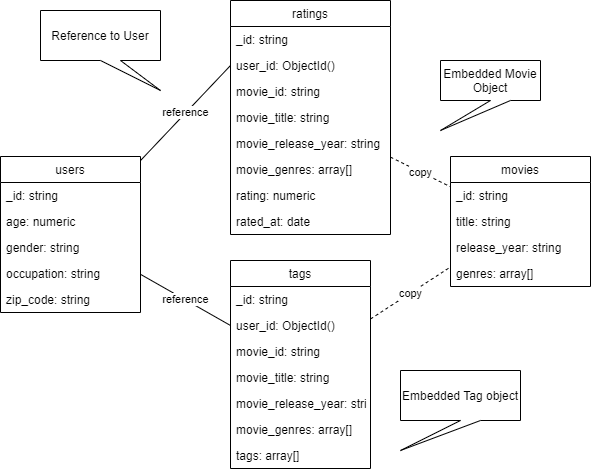
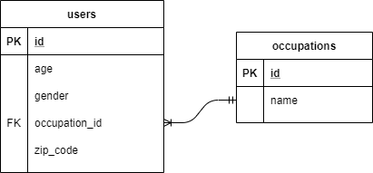
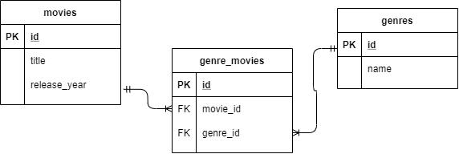
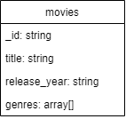
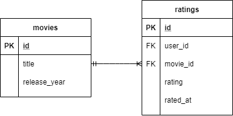
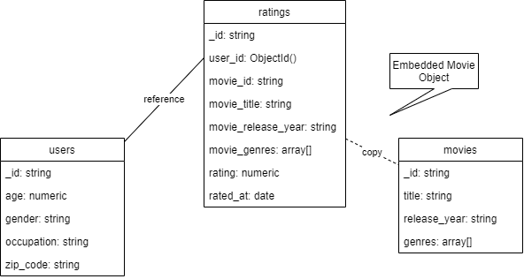

# Datenmodell
Gegenüber relationalen Datenbanken sind in Dokument-orientierten DBMS über die Angabe von Datenbanken und Collections hinaus keine Vorbereitungen bezüglich des Schemas, z.B. in Form von DDL Skripten, zu treffen.

Folgende Inhalte aus [MongoDB Data Modeling](https://www.mongodb.com/docs/manual/core/data-modeling-introduction/):

Dokumente müssen innerhalb einer Collection nicht strikt dem gleichen Schema folgen, d.h.

- Die Dokumente in einer Collection müssen nicht die gleiche Menge an Felder und den gleichen Datentyp aufweisen.
- Änderungen in der Struktur der Dokumente, wie z.B. das Hinzufügen neuer Felder, kann flexibel per Update auf die bestehenden Dokumente umgesetzt werden.

In der Praxis folgen die Dokumente allerdings oft einer zumindest sehr ähnlichen Struktur. Je nach Anwendungsfall ist ein Konsens aus Flexibilität und Datenintegrität zu wählen, der beispielsweise auf Applikationsebene über Datenvalidierung umgesetzt werden kann.

## Wesentliche Aspekte im Entwurf
Neben der Wahl der Collections und Ausgestaltung der Dokumente, gibt es im Unterschied zum relationalen Modell besondere Aspekte. Während sich das relationale Modell durch strikte referentielle Integrität und Normalisierung auszeichnet, ist dies bei NoSQL Ansätzen durchaus unterschiedlich.

In [MongoDB Data Modeling](https://www.mongodb.com/docs/manual/core/data-modeling-introduction/) wird betont:
Eine Kernentscheidung beim Entwurf des Datemodells ist die Abbildung von Beziehungen entweder als **eingebette Objekte** oder als **Referenzen**. MongoDB untersützt beide Varianten.

# Vorgeschlagenes Datenmodell - Übersicht
Folgender Vorschlag dient als Ausgangspunkt der Diskussion.

Wir betrachten die einzelnen Aspekte nachfolgend im Detail und ziehen Vergleiche zum relationalen Modell.

## Normalisierung und Datenintegrität
Im relationalen Modell wird Normalisierung angewendet (oft 3. Normalform oder Backus-Naur-Normalform). Dies führt beispielsweise zu folgender Aufteilung der Relationen "users" und "occupations":

Im obigen Modell ist die Occupation (der Beruf) als Attribut eines Nutzers modelliert.

> **_Aufgabe 2.1:_** Was ist im relationalen Modell nötig, um einen Nutzer einschließlich seines Berufs zu selektieren? Warum könnte die Variante des Dokument DBMS unter Performance-Aspekten die bessere Wahl sein?

> **_Aufgabe 2.2:_** Wie verhält sich das relationale Modell, wenn sich Attribute eines verknüpften Objekts ändern, z.B. der Name des Berufs? Inwieweit fällt dies unter den Aspekt der Datenintegrität? Hat dies Vorteile hinsichtlich dem Aspekt der Konsistenz, insbesondere für analytische Zwecke?

## Referentielle Integrität
Betrachten wir ein weiteres Beispiel bezüglich eines weiteren Gesichtspunkts: der referentiellen Integrität.

> **_Aufgabe 2.3:_** Wie verhält sich das relationale Modell, wenn ein Genre Objekt gelöscht werden soll, das jedoch noch mit einigen Filmen verknüpft ist? Welchen Vorteil bietet dies bezüglich der Datenintegriät?

Betrachten wir demgegenüber die obige Variante in Bezug auf Movies.

> **_Aufgabe 2.4:_** Wie ist vorzugehen, um bei einem ausgewählten Movie, ein bestimmtes Genre zu löschen? Wie müsste man vorgehen, um ein bestimmtes Genre bei allen Movies umzubennen oder zu löschen? Welche Vor- und Nachteile sehen Sie?

> **_Zusatzaufgabe:_** Angenommen, Sie möchten eine Weak-Entity Beziehung abbilden, d.h. eine Master-Detail Beziehung, bei dem das Detail Objekt nicht existieren darf, wenn das Master Objekt gelöscht wird. Wie verhält sich das Dokument-orientierte DBMS beim Löschen von Master-Objekten. Wie müssten Sie vorgehen, um auch die Detail Objekte zu löschen (Stichwort: "orphaned relations")?

## Eingebetette Objekte und Referenzen
MongoDB erlaubt ebenfalls Normalisierung über Objekt-Referenzen, die in einigen Punkten Fremdschlüsseln entsprechen. Es gibt jedoch keine referentielle Integrität, d.h. die Objektreferenz wird nicht geprüft. Bisher wurde noch nicht überlegt, ob dies auch Vorteile, insbesondere in Bezug auf Datenhistorien hat.

Betrachten wir dazu die Relationen Movies und Ratings des relationalen Modells.

> **_Aufgabe 2.5:_** Wie verhält sich das relationale Modell in diesem Szenario? Würde das Attribut rated_at helfen, um die Historie der Bewertungen abzubilden?

Im relationalen Modell hat man mehrere Möglichkeiten einen solchen Zusammenhang abzubilden. Die gezeigte Modellierungsvariante erlaubt, dass ein Nutzer für den gleichen Film, mehrmals Ratings vergibt.

> **_Aufgabe 2.6:_** Welche Modellierungsvariante existiert im relationalen Modell, um zu garantieren, dass ein Nutzer nur genau ein Rating pro Film abgibt? Welche Auswirkungen hat dies auf die Historie der Daten, falls ein Nutzer einen Film mehrfach bewertet?

Im Dokument-orientierten DBMS wurde diese Modellierungsvariante gewählt:

> **_Aufgabe 2.7:_** Wie verhält sich diese Variante bei der mehrfachen Vergabe von Ratings für den gleichen Film? Worin sehen Sie unterschiede bezüglich der Abbildung von Beziehungen als eingebettes Objekt bzw. als Referenz. Welche Vor- und Nachteile resultieren daraus? Denken Sie auch an die Analyse historischer Daten im Rahmen von Data Science Projekten.

Eine weitere Besonderheit ist die modellierung eines Films als eingebettes Objekt. 

> **_Aufgabe 2.8:_** Nehmen wir an, ein Film Objekt hat sich im Zeitverlauf geändert, es wurden weitere Genres hinzugefügt. Angenommen, dies hat einen Nutzer dazu bewogen, den Film nochmals zu bewerten. Könnte man dies anhand des Dokument-Modells einfach feststellen?

## Fazit: Performance versus Datenintegrität
Der Grad der Normalisierung könnte genau so, wie in der relationalen Datenbank gewählt werden. Dann stellt sich jedoch die Frage, wozu man überhaupt eine Dokument-Datenbank einsetzt. Der Vorteil einer einzigen einfachen Abfrage für ein fertig darstellbares Dokument wäre dann nicht mehr gegeben. Es gilt einen Konsens aus Abfrage-Optimierung und Datenkonsistenz zu erzielen.

Für die Modellierung des Beispiels waren folgende Überlegungen ausschlaggebend:

Folgende Entitäten wurden in einer Collection zusammengefasst, um Joins zu vermeiden, die sowieso bei einer typischen Abfrage angefallen wären:
- Tabelle users und occupations werden zur "users" Collection zusammengefasst.
- Tabelle movies und genres werden zur "movies" Collection zusammengefasst.

Generell bietet es sich oft an 1:m Beziehungen zusammenzufassen.

Es bleiben die m:n Beziehungen ratings und tags. Beide sind Nutzer-spezifisch und werden bei Bedarf als Detailinformation zu ausgewählten Movies abgefragt.

- Ratings haben eine Beziehung zu Usern und Movies. Ein Rating ist eine Aktion eines Users auf ein Movie. Hier könnte Normalisierung eingesetzt werden, um zu vermeiden, dass z.B. die Daten von Movies in ein eigenes Ratings Objekt kopiert werden. Statt dessen, bieten sich Objekt-Referenzen an.

Normalisierung sollte genutzt werden, falls:
- Die Daten des referenzierten Objekts sich häufig ändern, und man keine Kopien synchron halten möchte (anders bei Genre!).
- Manchmal ist es aber gewünscht, zum Zeitpunkt des Ratings den aktuellen Zustand eines Users zu kennen. Solche historischen Daten sind über Kopien zu erhalten.
Beispielhaft wird der Nutzer per Objekt-Referenz abgebildet, das Movie-Objekt aber komplett kopiert.

Dies führt zu folgenden allgemeinen Überlegungen:
- Aggregate sind innerhalb eines Dokuments möglich, insbesondere für Master/Detail Beziehungen. Besonders vorteilhaft für Webapplikationen mit REST-Schnittstellen. Die Applikation kann oft ein bestimmtes Dokument einschließlich Beziehungen ohne weitere Joins selektieren.
- Ein großer Teil der Verantwortung, insbesondere bezüglich Schema-Validierung, Datenkonsistenz und Umgang mit Redundanz, wird in die Applikation verschoben.

## Schlüssel
Das relationale Modell erlaubt die Definition zusammengesetzter Schlüssel. Ein **Primärschlüssel** ist eine minimale Kombination aus Attributen, um einen Record eindeutig zu identifizieren. Dies kann mithilfe von künstlichen oder natürlichen Schlüsseln erreicht werden (Vgl. Meier & Kaufmann (2019), S. 4f).

In Dokument-orientierten Datenbanken wird oft ein spezielles Verfahren eingesetzt, um Dokumenten einen eindeutigen Wert zuzuweisen. Dies kann ein Hashverfahren sein (z.B. bei CouchDB), das Dokumenten anhand ihrer Gesamtheit (Name/Wert Paare), einen eindeutigen Wert zuweist und somit auch Duplikate erkennen kann. 

In MongoDB ist das Primärschlüsselfeld vorgegeben und wird mit "_id" Bezeichnet. Es verwendet einen anderen Ansatz bestehend aus einer Kombination aus Timestamp, Zufallswert und Counter ([MongoDB ObjectId()](https://www.mongodb.com/docs/manual/reference/method/ObjectId/)). Das Präfix "_" deutet bereits an, dass dieses Feld versteckt bzw. privat ist. Viele Systeme verlangen als Best Practice, dass das Feld durch das DBMS verwaltet und befüllt wird. Einige System erlauben jedoch, dass es durch den Nutzer festgelegt werden kann.

> **_Aufgabe 2.9:_** Welche Vor- und Nachteile entstehen in Dokument-orientierten DBMS daraus, dass kaum noch Einfluss auf die Gestaltung des Primärschlüssels hat?

# Datentypen
In MongoDB werden JSON (genauer BSON) Dokumente verwendet, wodurch die Standard Datentypen unterstützt werden. 

MongoDB unterstützt die JSON-Datentypen:
- Boolean - "key": true
- Numeric - "key": 42
- Null - "key": null
- String - "key": "Hello World"
- Array - "key": [42, "a", false]

Darüber hinaus sind weitere MongoDB-spezifische Datentypen möglich:
- Number - "key": 42.34
- Date - "key": new Date()
- Regex - "key": /a+/
- Embedded Doc - "key": {}
- ObjectId - "key": ObjectId(...)
- Binary - "key": non-UTF-8 string
- Code - "key": function() {}

MongoDB hat ein Größenlimit von 16MB pro Dokument. Für größere Dateien kann GridFS verwendet werden.

