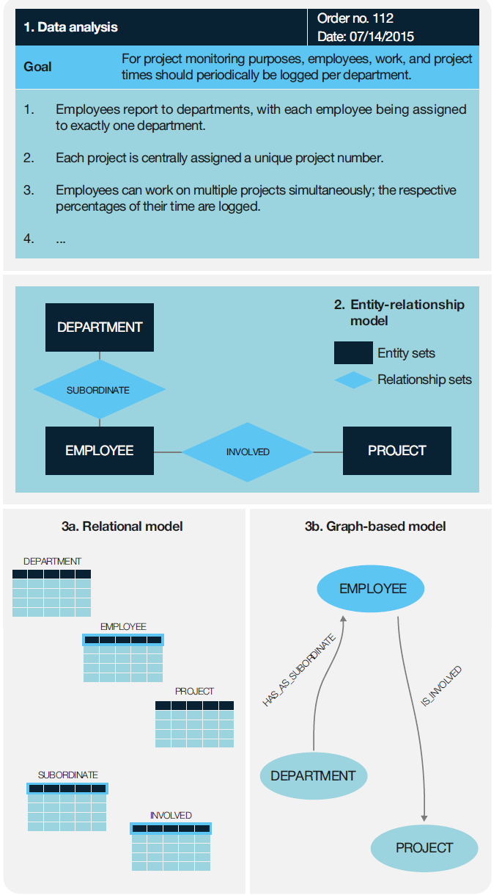

# Aufbau und Übersicht
Die Übungsveranstaltung behandelt mehrere Datenbankmanagementsysteme aus der relationalen und NoSQL Welt. Die Systeme sind in folgende Kategorien unterteilt, die jeweils in einem Unterordner in diesem Projektverzeichnis aufgeführt sind:

| Kategorie   |      Uebung      |  Beschreibung |
|----------|:-------------:|:------:|
| Relationale DB |   [Uebung 1 - Relationale DB](RelationalDB/RelationalDB.md)   | Auf dem relationalen Modell und SQL basierende Systeme  |
| Dokument-orientierte DB |  [Uebung 2 - DocumentDB](DocumentDB/DocumentDB.md) | Für die Verwaltung von Dokumenten (JSON, XML, ...) optimierte Systeme. |
| Key/Value Stores |   | Key/Value Stores für die effiziente Verwaltung untypisierter Name/Wert Paare |
| (Wide) Column Stores |   |  |
| Graph Database |   |  |

Jede Veranstaltung fokussiert eine der oben genannten Kategorien und folgende Aspekte:
1. Einrichtung eines Datenbankmanagementsystems mithilfe von Docker. Direkte Interaktion mit dem DBMS via CLI. Vorbereitung ausgewählter Datensätze für das jeweilige DBMS.
2. Diskussion der Datenmodellierung, kritische Würdigung der jeweiligen Besonderheiten.
3. Umsetzung typischer Abfragen und Diskussion der jeweiligen Besonderheiten.
4. Betrachtung der Applikationsebene, insbesondere der Verteilung der Verantwortung zwischen DBMS und Applikation.

> **_Aufgabe:_** Innerhalb der jeweiligen Dokumente sind Verständnisfragen sowie praktische Aufgaben enthalten und durch eine Box gekennzeichnet.

## (1) Einrichtung des DBMS
Die Veranstaltung nutzt Docker, um auf einfache Weise, verschiedene DBMS aufzusetzen und kennenzulernen. Dazu ist ein Dockerhub Zugang nötig, um die entsprechenden Images beziehen zu können. 
Alle DBMS sind vorbereitet mithilfe von Docker Compose und folgender Struktur:
- Für jedes ausgewählte DBMS existiert ein Unterordner "DockerHome", der als Ausgangspunkt für die Einrichtung per Docker dient.
- Der DockerHome Ordner enthält eine docker-compose.yaml mit einem verknüpften DataDir. Dadurch hat man als Anwender volle Kontrolle über das Datenverzeichnis und kann es mit bereits vorbereiteten Daten initialisieren.

Häufig existieren mehrere Tools für die jeweiligen DBMS. In der Übung wird hauptsächlich das zugehörige Command Line Interface (CLI) verwendet, um die Grundbefehle kennenzulernen. Viele GUI-basierte Tools abstrahieren von der CLI und führen oft für den Entwickler transparent mehrere CLI Befehle im Hintergrund aus. Dies ist zwar produktiver, erschwert aber typischerweise das Erlernen der Systeme.

**Vorbereitung ausgewählter Datensätze**: Für die Veranstaltung werden verschiedene Datensätze verwendet, um die Besonderheiten der jeweiligen DBMS kennenzulernen. Die Datensätze sind im Ordner [Datasets](Datasets/Datasets.md) beschrieben.

## (2) Diskussion Datenmodellierung
Ein Datenmodell orientiert sich an der abzubildenden Realität, den tatsächlich stattfindenden Datenflüssen sowie den Anwendungsfällen bzw. Workloads, um möglichst effizientes Lesen und Schreiben von Datensätzen zu ermöglichen.

Typischerweise existiert daher nicht "das eine Datenmodell", sondern mehrere für den jeweiligen Anwendungsfall passende Alternativen mit unterschiedlichen Kompromissen. Häufig wird eine schrittweise Modellierung, wie in der Abbildung dargestellt angewandt, um mithilfe eines logischen Datenmodells von dem konkreten DBMS zu abstrahieren. (Meier & Kaufmann (2019), S. 27)

Die Datenmodelle unterscheiden sich typischerweise in Abhängigkeit des eingesetzen DBMS, womit Vor- und Nachteile einhergehen. In diesem Abschnitt werden Varianten diskutiert und kritisch gewürdigt.

## (3) Umsetzung typischer Abfragen
Typische Abfragen werden in der jeweiligen Sprache der DBMS umgesetzt, um den praktischen Umgang mit den Systemen zu erlernen. Dazu wird die jeweils verfügbare CLI verwendet, um möglichst direkte Interaktion zu gewährleisten.

## (4) Applikationsebene
Eine Datenbank und ein Datenmodell werden für ausgewählte Zwecke erstellt, die Interaktion mit der Applikation ist ein wichtiger Bestandteil der Gesamtlösung. Oft unterscheiden sich die DBMS bezüglich der Verantwortungsaufteilung zwischen DBMS und Applikation hinsichtlich der Aspekte Datenkonsistenz, Schemaverwaltung, Verarbeitungskapazitäten und weitere.

## Vereinfachungen und Out of Scope
Die Veranstaltung beinhaltet mehrere Vereinfachungen. Eine wesentliche Vereinfachung ist die Annahme eines Single-Node Betriebs des DBMS, also keine verteilten Cluster Lösungen. In dieser Übung werden NoSQL DBMS in einem standalone Modus betrachtet. Die größten Vorteile spielen solche Systeme oft erst im Clusterbetrieb aus. RDBMS sind hingegen für den standalone Modus in Client/Server Architekturen entworfen und benötigen typischerweise zusätzliche Komponenten zur Koordination der Knoten in einem Cluster.

 Zudem geht die Veranstaltung nicht auf folgende Aspekte ein:
- Datenbank Administration
- Security und User Management

# Voraussetzungen
Um die DBMS miteinander zu vergleichen, werden folgende Konzepte vorausgesetzt bzw. wiederholt:
- [ACID und BASE](ACID_BASE.md)

Für verteilte Datenbanken ist weiterführend das CAP Theorem releveant
- [CAP Theorem](CAP_Theorem.md)
