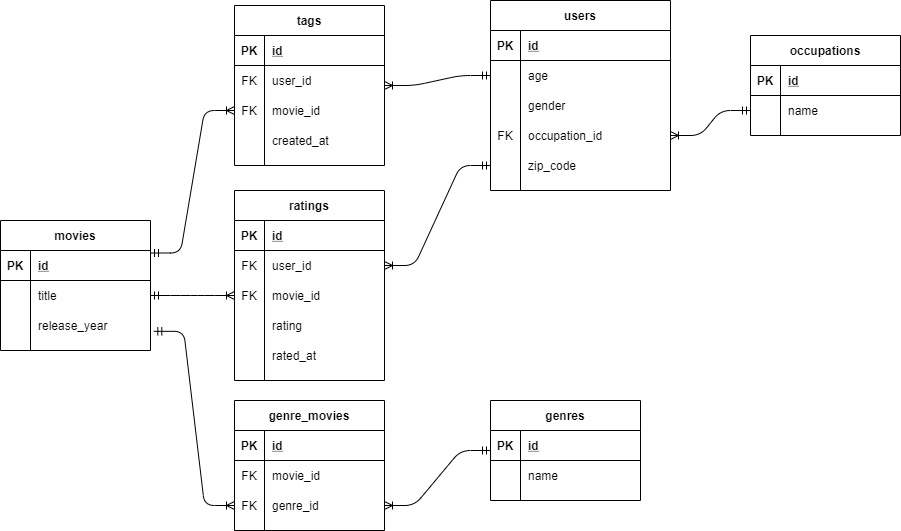

# Relationale Modellierung
Für relationale Modelle existieren verschiedene Modellierungsansätze. Eine Möglichkeit besteht darin, die beteiltigten Entitäten als Akteure aufzufassen und deren Beziehungen als Aktionen, die von den Akteuren durchgeführt werden.

Relationale Modelle sind feingranular aufgebaut und strikt nach Entitäten und deren Beziehungen getrennt. Da mengenwertige Attribute in Normalformen nicht erlaubt sind, werden diese typischerweise über Beziehungstabellen abgebildet. Ebenso werden Master/Detail Beziehungen in separaten Tabellen abgebildet, insbesondere über Weak-Entities.

## Beispiel Movielens
Eine beispielhafte Modellierung des Movielens Datasets könnte mit obigem Ansatz wie folgt aussehen:
- Movie, User und Genre sind Akteure/Entitäten.
- Ein User vergibt ein Rating für ein Movie (Aktion). Ein Rating kann wiederum als eigene Entität oder als Attribut einer m:n Beziehung zwischen User und Movier interpretiert werden.
- Ein User vergibt Tags für Movies (Aktion).
- Komplexere m:n Beziehungen werden über eigene Relationship-Tabellen abgebildet, z.B. movies_genres.

### Relationales Modell

### Verständnisfragen

---
** (1) Warum ist ein relationales Modell für die Sicherung von Datenqualität geeignet?**
- Als Beispiel dient die Tabelle "ratings".
- Diese Tabelle hat im aktuellen Schema einen künstlichen Schlüssel "id" für ein einzelnes Rating.
- Ist es möglich sicherzustellen, dass ein Nutzer höchstens ein Rating pro Movie abgibt?
- Wie hilft das Konzept der "referentiellen Integrität" bei der Integerität der Beziehungen?
---

---
** (2) Warum ist ein relationales Modell für die Sicherung von Datenqualität geeignet?**

- Ein anderes Beispiel ist die genre Tabelle.
- Warum wird nicht direkt ein Genre in den anderen Tabellen angegeben. Welchen Vorteil bringt die Verwendung einer ID als Fremdschlüssel bei derartigen Enumerations?
---

---
** (3) Welchen Effekt hat die Typisierung der Attribute auf die Datenqualität?**

- Wie kann beispielsweise das Attribut "age" der User Tabelle gestaltet werden?
---

---
** (4) Welche Nachteile haben normalisierte Relationen?**
---

## Kritische Würdigung Relationales Modell

### Vorteile
- Robustes DBMS geeignet für hohe Anforderungen an Datenkonsistenz.
- Modell folgt dem ACID Paradigma, insbesondere durch Transaktionen.
- Schlüsselbeziehungen und Constraints helfen Datenqualität zu gewährleisten.
- Typsicherheit durch Angabe von Datentypen pro Spalte.
- Effizienz durch Vermeidung von Redundanzen durch Normalisierung.
- Performance Optimierung durch Indizes.

### Schwächen Relationale DB
Das relationale Modell ist ein bewährter Generalist. Alle anderen noSQL Datenbanken sind oft Spezialisten, die in ihrem Nischenbereich hervorragend sind, sonst aber ebenfalls ineffizient sein können.
Key/Value und Graph sind schwer bzw. nicht effizient mit relationalen Datenbanken umsetzbar.

